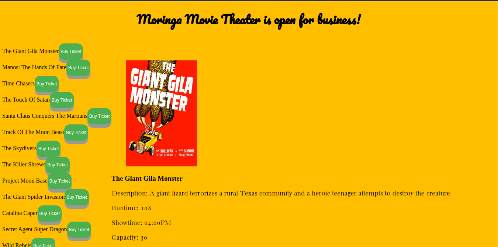
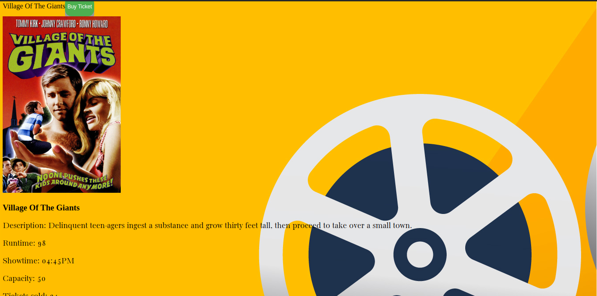

# Moringa Movie App(codechallenge3)

#### Created By Martin Nyaga 30-6-2023

## Git Link

[Git](https://github.com/MartinNyaga/codeChallenge3)

## Description

Moringa Movie app is a web app created to showcase available movies in the moringa school database and be able to buy the movie tickets. The app then updates the server and when tickets are sold out you will get an alert and cannot oversell.

## Setup Requirements

- Git
- Web-browser or your choice
- Github
- json server

## Development server

Run `json-server --watch db.json` for the server. Navigate to `http://localhost:3000/films/` and the app will run on the browser. 

## Technologies Used

The following have been used on this project:

- HTML
- CSS
- JavaScript

## Screenshots 

- Homepage

  

- Movie Name Clicked

  

## Known Bugs

No known bugs at the moment

## Support and contact details 

To make a contribution to the code used or any suggestions you can click on the contact link and email me your suggestions.

- Email: martin.nyaga@student.moringaschool.com

## License

Copyright (C) {{ 2023 }} {{ Martin Nyaga }}

Permission is hereby granted, free of charge, to any person obtaining
a copy of this software and associated documentation files (the
"Software"), to deal in the Software without restriction, including
without limitation the rights to use, copy, modify, merge, publish,
distribute, sublicense, and/or sell copies of the Software, and to
permit persons to whom the Software is furnished to do so, subject to
the following conditions:

The above copyright notice and this permission notice shall be
included in all copies or substantial portions of the Software.

THE SOFTWARE IS PROVIDED "AS IS", WITHOUT WARRANTY OF ANY KIND,
EXPRESS OR IMPLIED, INCLUDING BUT NOT LIMITED TO THE WARRANTIES OF
MERCHANTABILITY, FITNESS FOR A PARTICULAR PURPOSE AND
NONINFRINGEMENT. IN NO EVENT SHALL {{ organization }} BE LIABLE FOR ANY
CLAIM, DAMAGES OR OTHER LIABILITY, WHETHER IN AN ACTION OF CONTRACT,
TORT OR OTHERWISE, ARISING FROM, OUT OF OR IN CONNECTION WITH THE
SOFTWARE OR THE USE OR OTHER DEALINGS IN THE SOFTWARE.

Except as contained in this notice, the name of {{ organization }} shall
not be used in advertising or otherwise to promote the sale, use or
other dealings in this Software without prior written authorization
from {{ organization }}.

{{ Moringa Movie App }} is a trademark of {{ Martin Nyaga }}.